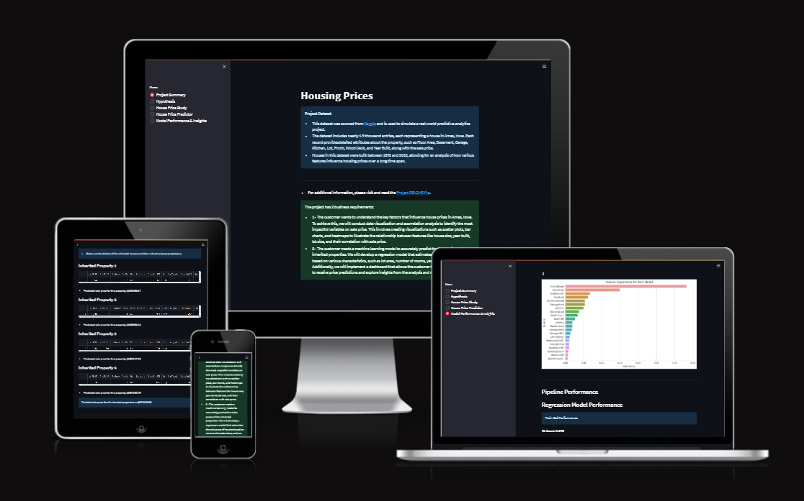
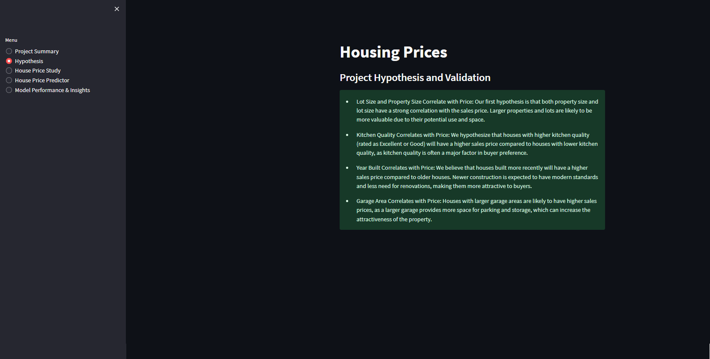
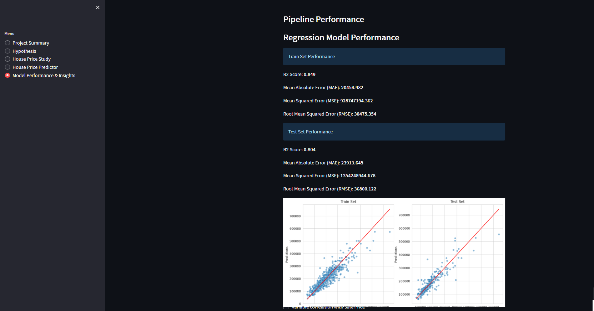
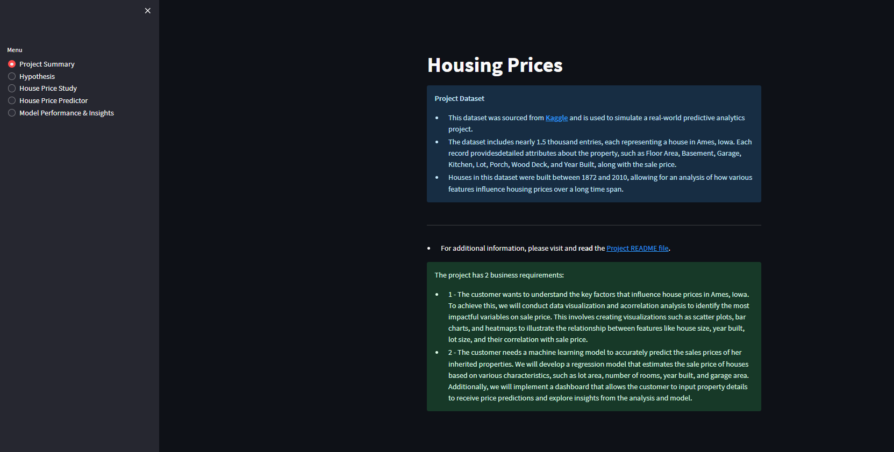
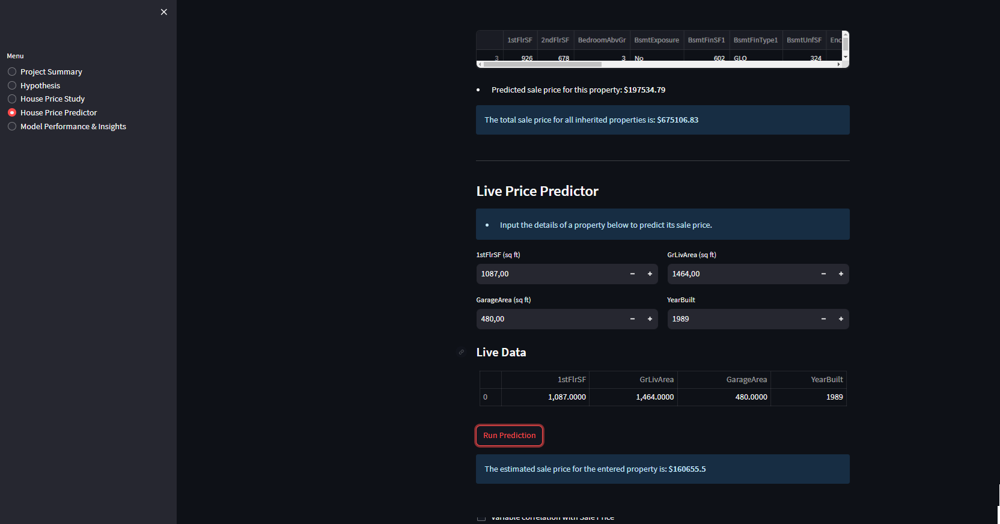

# Housing Prices

Visit live site [here](https://iowa-house-price-prediction-5717aa87801c.herokuapp.com/).



- [Housing Prices](#housing-prices)
  * [Introduction & Overview](#introduction---overview)
    + [Purpose](#purpose)
    + [Dataset Content](#dataset-content)
      - [Key Features of the Dataset:](#key-features-of-the-dataset-)
  * [Business Requirements](#business-requirements)
    + [Business Requirement 1: Data Visualization and Correlation](#business-requirement-1--data-visualization-and-correlation)
    + [Business Requirement 2: Price Prediction Using Machine Learning](#business-requirement-2--price-prediction-using-machine-learning)
  * [Hypotheses and Validation](#hypotheses-and-validation)
  * [Rationale for Mapping Business Requirements to Tasks](#rationale-for-mapping-business-requirements-to-tasks)
    + [Business Requirement 1: Data Visualization and Correlation](#business-requirement-1--data-visualization-and-correlation-1)
    + [Business Requirement 2: Price Prediction Using Machine Learning](#business-requirement-2--price-prediction-using-machine-learning-1)
  * [ML Business Case](#ml-business-case)
    + [Predicting Sale Prices](#predicting-sale-prices)
  * [CRISP-DM Methodology](#crisp-dm-methodology)
    + [1. Business Understanding](#1-business-understanding)
    + [2. Data Understanding](#2-data-understanding)
    + [3. Data Preparation](#3-data-preparation)
    + [4. Modeling](#4-modeling)
    + [5. Evaluation](#5-evaluation)
    + [6. Deployment](#6-deployment)
  * [Dashboard Design](#dashboard-design)
    + [1. Hypothesis Page (`page_hypothesis.py`)](#1-hypothesis-page---page-hypothesispy--)
    + [2. Predict Sales Price Page (`page_predict_sales_price.py`)](#2-predict-sales-price-page---page-predict-sales-pricepy--)
    + [3. Sales Price Study Page (`page_sales_price_study.py`)](#3-sales-price-study-page---page-sales-price-studypy--)
    + [4. Summary Page (`page_summary.py`)](#4-summary-page---page-summarypy--)
    + [5. Predict Price for Live Data (`page_price_predictor.py`)](#5-predict-price-for-live-data---page-price-predictorpy--)
    + [6. Multi-Page Management (`multi_page.py`)](#6-multi-page-management---multi-pagepy--)
  * [Unfixed Bugs](#unfixed-bugs)
  * [Deployment](#deployment)
    + [1. **Deployment on Heroku**](#1---deployment-on-heroku--)
    + [2. **Running Locally**](#2---running-locally--)
  * [Main Data Analysis and Machine Learning Libraries](#main-data-analysis-and-machine-learning-libraries)
    + [Data Analysis and Visualization](#data-analysis-and-visualization)
    + [Machine Learning](#machine-learning)
    + [Dashboard](#dashboard)
    + [Miscellaneous](#miscellaneous)
  * [Technologies Used](#technologies-used)
    + [Programming Languages](#programming-languages)
    + [Libraries and Frameworks](#libraries-and-frameworks)
    + [Data Profiling](#data-profiling)
    + [Data Processing and Validation](#data-processing-and-validation)
    + [Deployment and Hosting](#deployment-and-hosting)
    + [Tools and Environments](#tools-and-environments)
    + [Visualization Tools](#visualization-tools)
    + [Code Quality and Linting](#code-quality-and-linting)
  * [Credits](#credits)
    + [Content](#content)
  * [Acknowledgements](#acknowledgements)

## Introduction & Overview

This project, **Housing Prices**, is designed to analyze housing data from Ames, Iowa, and provide insights into the key factors that influence house prices. The goal is to assist the client, Lydia, in making informed decisions about selling her inherited properties by leveraging data visualizations and predictive analytics.

### Purpose
The primary purpose of this project is to:
1. Understand how house attributes, such as size, quality, and location, correlate with sale prices.
2. Develop a machine learning model to accurately predict the sale prices of properties based on their attributes.

### Dataset Content

* The dataset is sourced from [Kaggle](https://www.kaggle.com/codeinstitute/housing-prices-data).
* The dataset has almost 1.5 thousand rows and represents housing records from Ames, Iowa, indicating house profile (Floor Area, Basement, Garage, Kitchen, Lot, Porch, Wood Deck, Year Built) and its respective sale price for houses built between 1872 and 2010.

|Variable|Meaning|Units|
|:----|:----|:----|
|1stFlrSF|First Floor square feet|334 - 4692|
|2ndFlrSF|Second-floor square feet|0 - 2065|
|BedroomAbvGr|Bedrooms above grade (does NOT include basement bedrooms)|0 - 8|
|BsmtExposure|Refers to walkout or garden level walls|Gd: Good Exposure; Av: Average Exposure; Mn: Minimum Exposure; No: No Exposure; None: No Basement|
|BsmtFinType1|Rating of basement finished area|GLQ: Good Living Quarters; ALQ: Average Living Quarters; BLQ: Below Average Living Quarters; Rec: Average Rec Room; LwQ: Low Quality; Unf: Unfinshed; None: No Basement|
|BsmtFinSF1|Type 1 finished square feet|0 - 5644|
|BsmtUnfSF|Unfinished square feet of basement area|0 - 2336|
|TotalBsmtSF|Total square feet of basement area|0 - 6110|
|GarageArea|Size of garage in square feet|0 - 1418|
|GarageFinish|Interior finish of the garage|Fin: Finished; RFn: Rough Finished; Unf: Unfinished; None: No Garage|
|GarageYrBlt|Year garage was built|1900 - 2010|
|GrLivArea|Above grade (ground) living area square feet|334 - 5642|
|KitchenQual|Kitchen quality|Ex: Excellent; Gd: Good; TA: Typical/Average; Fa: Fair; Po: Poor|
|LotArea| Lot size in square feet|1300 - 215245|
|LotFrontage| Linear feet of street connected to property|21 - 313|
|MasVnrArea|Masonry veneer area in square feet|0 - 1600|
|EnclosedPorch|Enclosed porch area in square feet|0 - 286|
|OpenPorchSF|Open porch area in square feet|0 - 547|
|OverallCond|Rates the overall condition of the house|10: Very Excellent; 9: Excellent; 8: Very Good; 7: Good; 6: Above Average; 5: Average; 4: Below Average; 3: Fair; 2: Poor; 1: Very Poor|
|OverallQual|Rates the overall material and finish of the house|10: Very Excellent; 9: Excellent; 8: Very Good; 7: Good; 6: Above Average; 5: Average; 4: Below Average; 3: Fair; 2: Poor; 1: Very Poor|
|WoodDeckSF|Wood deck area in square feet|0 - 736|
|YearBuilt|Original construction date|1872 - 2010|
|YearRemodAdd|Remodel date (same as construction date if no remodelling or additions)|1950 - 2010|
|SalePrice|Sale Price|34900 - 755000|

#### Key Features of the Dataset:
- **Numerical Attributes:**
  - `GrLivArea`: Above-ground living area in square feet.
  - `GarageArea`: Size of the garage in square feet.
  - `TotalBsmtSF`: Total basement area in square feet.
  - `YearBuilt`: Year the house was constructed.

- **Categorical Attributes:**
  - `OverallQual`: Overall material and finish quality (rated from 1 to 10).
  - `KitchenQual`: Kitchen quality (rated as Excellent, Good, Typical/Average, or Fair).
  - `GarageFinish`: Interior finish of the garage.

- **Target Variable:**
  - `SalePrice`: The price at which the house was sold, ranging from $34,900 to $755,000.

By analyzing and processing these features, the project aims to generate actionable insights and provide reliable price predictions for both Lydia's inherited properties and any custom property input through the dashboard.

---

## Business Requirements

### Business Requirement 1: Data Visualization and Correlation
Lydia wants to understand the key factors that influence house prices in Ames, Iowa. 
- **Objective:** Conduct data visualizations and correlation analysis to identify which variables have the strongest impact on sales price.
- **Deliverables:**
  - Create visualizations such as scatter plots, regression plots, and heatmaps to illustrate the relationship between house attributes (e.g., lot size, house size, year built) and sale price.
  - Summarize findings on the **Sales Price Study** page of the dashboard.

### Business Requirement 2: Price Prediction Using Machine Learning
Lydia needs a machine learning model to accurately predict the sales prices of her inherited properties and other houses in Ames, Iowa.
- **Objective:** Develop a regression model to predict house sale prices based on property features.
- **Deliverables:**
  - Build an interactive dashboard page, **Price Predictor**, where users can input house attributes and receive price predictions.
  - Display insights from the model, such as **feature importance**, to highlight the most impactful variables on house prices.
  - Evaluate model performance using metrics like **R² score** and **RMSE**.

---

## Hypotheses and Validation

1. **Lot Size and Property Size Correlate with Price:** Larger properties and lots are likely to have higher sales prices due to their potential use and space. 
   - **Validation:** Correlation analysis and scatter plots of lot size and property size against sale price.

2. **Kitchen Quality Correlates with Price:** Houses with higher kitchen quality (rated Excellent or Good) are expected to have higher sale prices as kitchen quality is often a major factor for buyers.
   - **Validation:** Analysis of kitchen quality categories and their average sale prices.

3. **Year Built Correlates with Price:** Newer houses are expected to have higher sale prices due to modern standards and reduced renovation needs.
   - **Validation:** Regression plots of year built against sale price.

4. **Garage Area Correlates with Price:** Larger garages provide more utility, making the property more desirable and increasing its value.
   - **Validation:** Scatter plots and regression analysis of garage area vs. sale price.

---

## Rationale for Mapping Business Requirements to Tasks

### Business Requirement 1: Data Visualization and Correlation
- **Goal:** Identify key factors influencing house prices.
- **Tasks:**
  - Conduct **Exploratory Data Analysis (EDA)** to understand feature distributions and relationships.
  - Use visualizations:
    - **Scatter plots** and **regression plots** to examine relationships between numerical features (e.g., `GarageArea`, `GrLivArea`) and sale price.
    - **Heatmaps** to highlight correlations between variables and identify strong predictors of sale price.
  - Summarize findings on the **Sales Price Study** dashboard page.

### Business Requirement 2: Price Prediction Using Machine Learning
- **Goal:** Build a regression model to estimate house prices.
- **Tasks:**
  - Train a **regression pipeline** using cleaned and preprocessed housing data.
  - Evaluate the pipeline with metrics like **R² score** to ensure reliability.
  - Develop an interactive **Price Predictor** dashboard page:
    - Users input house details to receive live predictions.
    - Provide model-generated insights, such as **feature importance**, to enhance interpretability.

---

## ML Business Case

### Predicting Sale Prices
- **Problem Statement:** Lydia needs to estimate the sales prices of her inherited properties and other houses in Ames, Iowa.
- **Approach:** 
  - Train a supervised regression model to predict the numerical sale price based on house attributes.
  - Use the model to deliver accurate price predictions via an interactive dashboard.
- **Success Criteria:**
  - Achieve an **R² score** of at least 0.75 on both training and test datasets.
  - Provide actionable insights through the **Price Predictor** dashboard to help Lydia make informed decisions.

---

## CRISP-DM Methodology

The project follows the **CRISP-DM (Cross Industry Standard Process for Data Mining)** methodology, a widely accepted framework for implementing data science projects. This methodology ensures a structured and systematic approach to understanding, analyzing, and deploying machine learning solutions.

### 1. Business Understanding
The project began with understanding the client's needs:
- **Objective:** To predict house prices in Ames, Iowa, based on their attributes and provide actionable insights.
- **Business Requirements:**
  1. Conduct a correlation study to identify how house attributes affect sale prices.
  2. Develop a machine learning model to predict the sale price of specific properties.

### 2. Data Understanding
- The dataset, sourced from [Kaggle](https://www.kaggle.com/codeinstitute/housing-prices-data), contains 1,460 rows and detailed house attributes such as size, year built, and overall quality.
- Initial exploratory data analysis (EDA) included:
  - Identifying missing values.
  - Understanding feature distributions.
  - Assessing potential relationships between features and the target variable (sale price).

### 3. Data Preparation
- **Data Cleaning:** Handled missing values using techniques such as median imputation and mode replacement for categorical variables.
- **Feature Engineering:**
  - Created new features, such as interaction terms between significant predictors.
  - Transformed skewed variables using log transformations to improve model performance.
  - Scaled numerical features to ensure consistency.
- **Feature Selection:** Selected the most impactful features for the model using correlation and feature importance analysis.

### 4. Modeling
- A regression model pipeline was developed using **scikit-learn**.
- Key steps included:
  - Splitting the dataset into training and testing sets.
  - Building a regression pipeline incorporating feature preprocessing and hyperparameter tuning.
  - Optimizing the model using grid search to find the best hyperparameters.

### 5. Evaluation
- Model performance was evaluated using metrics such as:
  - **R² Score:** Indicates how well the model explains variance in the sale price.
  - **Root Mean Squared Error (RMSE):** Measures prediction error magnitude.
- Achieved R² scores:
  - Training set: **0.849**
  - Test set: **0.804**
- Visualizations such as scatter plots of predicted vs. actual values were used to validate predictions.

### 6. Deployment
- The final model and its insights were deployed using **Streamlit** to create an interactive dashboard.
- Users can:
  - Input custom property data to predict sale prices.
  - Visualize key insights through correlation plots and feature importance charts.
- The application is hosted on **Heroku**, making it accessible for stakeholders.

This structured approach ensured alignment between the project objectives, data insights, and the final predictive tool, delivering a comprehensive solution for the client's needs.

---

## Dashboard Design

In this project, I did not create wireframes for the dashboard design. Instead, I used the [Churnometer](https://github.com/Code-Institute-Solutions/churnometer) walkthrough project by Code Institute as a template for structuring the dashboard.

The Churnometer project provided a solid foundation with its user-friendly design and functional layout built using Streamlit. Streamlit is a standard library for creating interactive dashboards, and its use ensures a standardized and professional approach to designing web applications. By adapting the structure of the Churnometer project, I was able to maintain a clean, intuitive interface while focusing on implementing business-specific requirements and features for the Heritage Housing project. This approach allowed me to deliver a functional dashboard efficiently.

The Streamlit dashboard consists of multiple pages, each designed to fulfill specific business requirements and provide a seamless user experience. Below is a detailed description of each page:

### 1. Hypothesis Page (`page_hypothesis.py`)
This page presents the key hypotheses of the project and their expected impact on house prices. 
- **Content:** 
  - Four hypotheses are displayed, focusing on variables like lot size, kitchen quality, year built, and garage area.
  - Information is presented using Streamlit's `st.success` to emphasize insights clearly.



### 2. Predict Sales Price Page (`page_predict_sales_price.py`)
This page provides an in-depth look into the machine learning pipeline used for house price prediction.
- **Content:** 
  - Visualizations of the pipeline's structure and feature importance.
  - Performance metrics (e.g., R² score, RMSE) for the training and test datasets.
  - Scatter plots comparing actual vs. predicted values for evaluation.
- **Interactive Features:**
  - Dynamic visualizations of feature importance and model predictions.



### 3. Sales Price Study Page (`page_sales_price_study.py`)
This page explores correlations between house attributes and sale prices to address the first business requirement.
- **Content:**
  - A correlation study for key variables like `GarageArea`, `GrLivArea`, `OverallQual`, etc.
  - Detailed insights about how these features influence house prices.
  - Regression plots showing the relationship between each variable and sale price.
- **Interactive Features:**
  - Checkboxes to inspect raw data and visualize specific correlations.


### 4. Summary Page (`page_summary.py`)
This page provides an overview of the project and its objectives, including dataset details and business requirements.
- **Content:**
  - Dataset description, including its source, key attributes, and time span.
  - Links to additional project documentation, such as the README file.
  - A summary of the two business requirements addressed in the project.



### 5. Predict Price for Live Data (`page_price_predictor.py`)
This page enables the user to input custom house data and predict its sale price using the regression model.
- **Content:**
  - Widgets for user input on key features such as `YearBuilt`, `GarageArea`, and `GrLivArea`.
  - Dynamic table displaying the live input data in real-time.
  - Predictions for both custom input and the client's inherited properties.
- **Interactive Features:**
  - Input widgets for live data.
  - A button to trigger the prediction and display the results.



### 6. Multi-Page Management (`multi_page.py`)
This file orchestrates the navigation and structure of the dashboard.
- **Content:**
  - A sidebar with a menu to navigate between pages.
  - Dynamic rendering of the selected page content.

---

## Unfixed Bugs

There are currently no known bugs in the application. 

However, during development, there were challenges related to managing Python dependencies, particularly with installations from the `requirements.txt` file in certain environments. These issues were resolved by carefully managing the virtual environment setup and ensuring compatibility with the correct package versions. 

Additionally, as the project heavily relies on machine learning libraries and Streamlit for deployment, users should ensure they are working in an environment compatible with these tools to avoid potential issues.

## Deployment

### 1. **Deployment on Heroku**

The project was deployed to Heroku, a cloud platform that simplifies application deployment. Below are the steps followed for deployment:

1. **Prepare Project Files**:
   - Ensure the following files are included in your project:
     - `requirements.txt` - Lists all dependencies for the project.
     - `Procfile` - Specifies how Heroku should run your application (e.g., `web: streamlit run app.py`).
     - `runtime.txt` - Specifies the Python version used (e.g., `python-3.10.12`).

2. **Create a Heroku Account and App**:
   - Log in to [Heroku](https://heroku.com).
   - Create a new app and provide it with a unique name.

3. **Connect Heroku to GitHub**:
   - Navigate to the **Deploy** tab in the Heroku dashboard.
   - Select "GitHub" as the deployment method and link your GitHub account.
   - Search for and select your project repository.

4. **Deploy the App**:
   - Choose the branch to deploy (usually `main`) and click "Deploy Branch."
   - Wait for the process to complete and click "Open App" to view the deployed application.

### 2. **Running Locally**

If you want to run the application locally instead of using Heroku:

1. **Clone the Repository**:
   - Clone the project from GitHub:
     ```bash
     git clone https://github.com/Darvid-223/housing-prices
     ```

2. **Install Dependencies**:
   - Navigate to the project folder and activate a virtual environment:
     ```bash
     python -m venv env
     source env/bin/activate  # On Windows: .\env\Scripts\activate
     ```
   - Install dependencies from `requirements.txt`:
     ```bash
     pip install -r requirements.txt
     ```

3. **Run the Application**:
   - Start the Streamlit application:
     ```bash
     streamlit run app.py
     ```

4. **Open in Browser**:
   - Open the local URL generated, typically `http://localhost:8501`.

---

## Main Data Analysis and Machine Learning Libraries

Below is a list of the main libraries used in this project, along with examples of their usage:

### Data Analysis and Visualization
- **Pandas**
  - Used for data cleaning, manipulation, and exploration.
  - Example: Handled missing data and selected key features for the regression model.
  ```python
  df['LotFrontage'] = df['LotFrontage'].fillna(df['LotFrontage'].median())
  key_features = df[['GrLivArea', 'GarageArea', 'YearBuilt', 'SalePrice']]
  ```

- **Matplotlib & Seaborn**
  - Used for creating visualizations like scatter plots and heatmaps to understand relationships between variables.
  - Example: Visualized correlations between features and sale price.
  ```python
  import seaborn as sns
  import matplotlib.pyplot as plt

  sns.heatmap(df.corr(), annot=True, cmap='coolwarm')
  plt.title("Correlation Heatmap")
  plt.show()
  ```

- **ydata-profiling**
  - Used to create detailed profiling reports of the dataset to identify patterns and anomalies.
  - Example: Generated a report to explore the dataset and detect missing values or unusual patterns.
  ```python
  from ydata_profiling import ProfileReport

  profile = ProfileReport(df, title="Housing Data Profiling Report")
  profile.to_file("housing_data_profile.html")
  ```

- **plotly**
  - Used to create interactive visualizations on the dashboard.
  - Example: Visualized the relationship between living area and sale price.
  ```python
  import plotly.express as px

  fig = px.scatter(df, x="GrLivArea", y="SalePrice", title="Living Area vs Sale Price")
  fig.show()
  ```

- **ppscore**
  - Used to calculate predictive power scores between variables.
  - Example: Evaluated how well a feature could predict the sale price.
  ```python
  import ppscore as pps

  score = pps.score(df, "GrLivArea", "SalePrice")
  print(score)
  ```

- **yellowbrick**
  - Used to visualize model performance and evaluation metrics.
  - Example: Displayed residual plots for regression model evaluation.
  ```python
  from yellowbrick.regressor import ResidualsPlot

  visualizer = ResidualsPlot(pipeline['regressor'])
  visualizer.fit(X_train, y_train)
  visualizer.score(X_test, y_test)
  visualizer.show()
  ```

### Machine Learning
- **Scikit-learn**
  - Used for creating and evaluating the regression pipeline.
  - Example: Implemented a pipeline for feature scaling and model training.
  ```python
  from sklearn.pipeline import Pipeline
  from sklearn.ensemble import RandomForestRegressor
  from sklearn.preprocessing import StandardScaler

  pipeline = Pipeline([
      ('scaler', StandardScaler()),
      ('regressor', RandomForestRegressor())
  ])
  pipeline.fit(X_train, y_train)
  ```

- **Feature-engine**
  - Used for feature engineering, including imputation and transformation.
  - Example: Replaced missing values and transformed skewed features.
  ```python
  from feature_engine.imputation import MeanMedianImputer

  imputer = MeanMedianImputer(imputation_method='median', variables=['GarageYrBlt'])
  df = imputer.fit_transform(df)
  ```

- **xgboost**
  - Used as an alternative regression tool to optimize model performance.
  - Example: Trained a gradient boosting regression model for predicting house prices.
  ```python
  import xgboost as xgb

  model = xgb.XGBRegressor()
  model.fit(X_train, y_train)
  predictions = model.predict(X_test)
  ```

### Dashboard
- **Streamlit**
  - Used to build an interactive dashboard for visualizing insights and making predictions.
  - Example: Created user input widgets for live predictions.
  ```python
  import streamlit as st

  year_built = st.number_input("Year Built", min_value=1872, max_value=2010, value=2000)
  prediction = pipeline.predict([[year_built, gr_liv_area, garage_area]])
  st.write(f"Predicted Sale Price: ${prediction[0]:,.2f}")
  ```

### Miscellaneous
- **Numpy**
  - Used for numerical computations and array manipulations.
  - Example: Applied transformations to numerical features for better model performance.
  ```python
  import numpy as np

  df['log_LotArea'] = np.log(df['LotArea'])
  ```

These libraries collectively enabled effective data processing, model training, and visualization, making it possible to deliver insights and predictions that align with the project’s business requirements.

---

## Technologies Used

This project utilizes a variety of tools, libraries, and platforms to meet the requirements and deliver a functional, user-friendly application. Below is a categorized list of technologies used:

### Programming Languages
- **Python**: The primary programming language used for data cleaning, machine learning, and backend development.

### Libraries and Frameworks
- **Streamlit**: Used for building the interactive dashboard and deploying the web app.
- **Scikit-learn**: For building and evaluating the regression pipeline.
- **XGBoost**: Leveraged for advanced regression modeling.
- **Feature-engine**: Used for feature engineering and preprocessing steps.
- **Pandas & NumPy**: Core libraries for data manipulation and analysis.
- **Matplotlib & Seaborn**: Used for creating static visualizations.
- **Plotly**: Integrated for interactive visualizations.
- **Yellowbrick**: Helped visualize model evaluation metrics.

### Data Profiling
- **ydata-profiling**: Provided detailed insights into the dataset for exploratory analysis.

### Data Processing and Validation
- **PPScore**: Used to compute predictive power scores for variable selection.
- **Imbalanced-learn**: Assisted with handling imbalanced datasets.

### Deployment and Hosting
- **Heroku**: Platform used to deploy the dashboard app for public access.
- **GitHub**: For version control and hosting the project repository.

### Tools and Environments
- **Jupyter Notebooks**: Used for data cleaning, exploratory analysis, and model experimentation.
- **Git**: Version control system to track changes and collaborate.
- **Gitpod**: Cloud-based development environment used for coding.
- **Markdown**: For documenting the README file and other project descriptions.

### Visualization Tools
- **Altair**: For additional data visualizations.
- **PPS**: Visualized predictive relationships between variables.

### Code Quality and Linting
- **Pylint**: Used to ensure code adheres to Python coding standards (PEP8) and to identify potential issues.
  - Example: Checking for unused imports, improper indentation, and missing docstrings.
  ```bash
  pylint app_pages/
  ```
  - Example of Pylint Output:
  ```bash
  ************* Module app_pages.page_summary
  app_pages/page_summary.py:1:0: C0114: Missing module docstring (missing-module-docstring)
  app_pages/page_summary.py:10:4: C0103: Variable name "df" doesn't conform to snake_case naming style (invalid-name)
  ```

--- 

## Credits

### Content
- The project was inspired by and adapted from the [Churnometer Walkthrough Project](https://github.com/Code-Institute-Solutions/churnometer) provided by Code Institute.
- The business requirements, CRISP-DM methodology, and dashboard structure were informed by the Code Institute course material and walkthrough projects.
- Machine learning concepts and techniques were referenced from the [Scikit-learn Documentation](https://scikit-learn.org/stable/documentation.html) and the [Feature-engine Documentation](https://feature-engine.trainindata.com/en/latest/).
- Regression modeling and pipeline design were guided by resources from [Towards Data Science](https://towardsdatascience.com/) and [Kaggle Notebooks](https://www.kaggle.com/).
- This README file is based on the [Code Institute's Template for the Heritage Housing Issues Project](https://github.com/Code-Institute-Solutions/milestone-project-heritage-housing-issues).
- Various YouTube videos on machine learning were used as supplementary resources to understand concepts and improve the project. 

---

## Acknowledgements

- Special thanks to Code Institute for the comprehensive learning material and walkthrough projects that served as the foundation for this project.
- Special thanks to my friend and former Code Institute student **Lucas Behrendt**, whose feedback and tips from his experience in the same course were immensely helpful.
- Special thanks to [Udemy's 100 Days of Code: The Complete Python Pro Bootcamp for 2023](https://www.udemy.com/course/100-days-of-code/) for providing comprehensive lessons on Python and object-oriented programming.
- Special thanks you to **Sheryl Goldberg**, who mentored me during my previous projects.
- Appreciation to my peers and the Slack community for answering questions and sharing resources.
- I would like to acknowledge the work of previous Code Institute students, including Vanessa and Vasi012, whose projects provided valuable insights and ideas. These projects served as occasional references for solving specific challenges and understanding how others approached similar problems. While this project is unique, the inspiration and guidance from past student work have been greatly appreciated.
- This project was developed with the assistance of OpenAI's ChatGPT in the following areas:
  - **Code Validation**: ChatGPT helped validate the syntax and logic of the code.
  - **Spelling and Grammar Checks**: Assisted in checking and correcting spelling and grammar in the documentation and code comments.
  - **Translations**: Provided translations for multilingual support in the documentation.
  - **Coding Advice**: Offered suggestions and advice on coding practices and problem-solving approaches.
  - **Real-Time Troubleshooting**: Supported real-time debugging and troubleshooting during the development process.
  - **Code Comments and Docstrings**: Helped in crafting clear and concise comments and docstrings to improve code readability and maintainability.
  - **README Structure and Language**: Assisted in organizing and refining the README file's structure and language to ensure clarity and professionalism.

